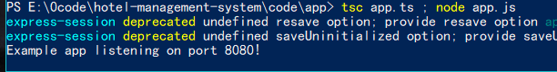
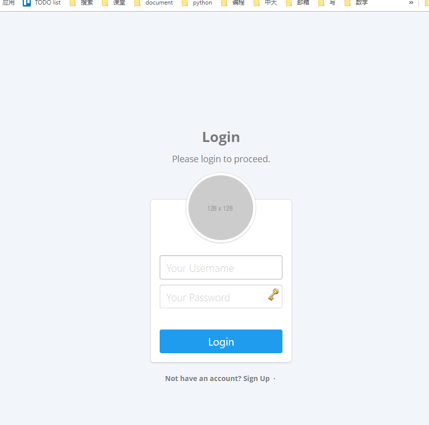

# Hotel Managerment System

## 文件说明

| 文件夹名 | 内容说明                                 |
| -------- | ---------------------------------------- |
| code     | 系统代码实现                             |
| data     | 测试数据以及生成测试数据所需的python代码 |
| document | api文档                                  |
| ER       | er图                                     |
| report   | 实验报告                                 |
| sql      | 一些sql语句，如存储过程                  |

## 运行方法

### 初始化运行时环境

在当前项目文件夹下，执行以下指令

```shell
cd ./code/app
npm install
```

### 运行

运行以下指令即可使系统运行起来

```shell
tsc app.ts ; node app.js
```



在浏览器打开`http://127.0.0.1:8080/query`，即可看到系统主界面



可以使用两种账号登录，也可以自己注册账号

1. 普通用户：用户名“123”，密码“123“
2. 酒店经理：用户名“root”，密码“whoisyourdaddy”

登陆后，便可以使用和测试该系统的各项功能。


## 测试样例

可见本目录文件夹“./test_vidio/"下的多个测试视频

