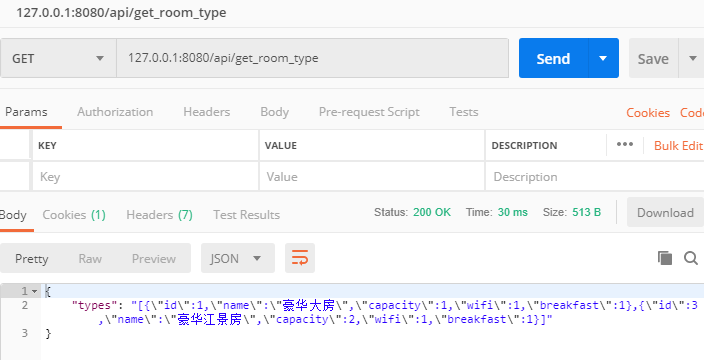

# 后端接口说明

1. 请求参数中，若为空串均为不指定（因此大多数字段都使用了string类型）
2. 相应的参数具有明确类型（如果int类型的就返回int类型二不是string）
3. 都是post请求

[TOC]


## 其他API

### API：我是谁

#### 方法

get方法

#### URL
(yb-ok)
`/api/i`

#### 响应示例及参数

```json
{
    "user_id" : 234,
    "username":"wyf",
    "role":0,
    "error_code":0
}
```


| 属性名    | 类型   | 值                                 |
| --------- | ------ | ---------------------------------- |
| user_id   | int | 用户在数据库中的唯一id                       |
| username    | string   | 用户名         |
| role | int | 0 : root ,3 : user |
| error_code | int | 0 表示无异常，1表示异常 |


## 房间预订子系统

###  API：查询可用房间

#### URL
(yb-ok)
`/api/query_avail_room`

#### 请求示例及参数

```json
{
    "check_in":"2018-02-12",
    //...以及其他属性
}
```


发送的json请求需要含有以下属性：

| 属性名    | 类型   | 值                                          |
| --------- | ------ | ------------------------------------------- |
| check_in  | string | 入住时间（%Y-%M-%D 如 2018-02-12)           |
| check_out | string | 退房时间（%Y-%M-%D 如 2018-02-15)           |
| capacity  | string | 最小容纳人数                                |
| wifi      | string | 是否要求wifi，空表示不指定，1表示必须有wifi |
| breakfast | string | 是否要求早餐，空表示不限定，1表示必须有早餐 |

#### 响应示例及参数

```json
{
    "rooms":[
        {
            "room_id" : "XXXXXX",
            "floor" : 4,
            "room_num" : 1103,
            "price" : 100,
            "breakfast" : "Yes",
            "wifi" : "No",
            "name" : "豪华双人房",
            "capacity" : 2
        },
        {
            //...（同上）
        }
    ]
}
```


| 属性名    | 类型   | 值                                 |
| --------- | ------ | ---------------------------------- |
| room_id   | string | 房间的唯一id                       |
| floor     | int    | 房间所在层数（1,2,3,4....)         |
| room_num  | int    | 房间的房号(如 101,503,1103等 )     |
| price     | int    | 房价(单位为元)                     |
| breakfast | string | 'No' 表示没有早餐，'Yes'表示有早餐 |
| wifi      | string | 'No'表示没有wifi，'Yes'表示有wifi  |
| name      | string | 房型的名称（豪华双人房）           |
| capacity  | int    | 房间所能容纳的最大人数             |

### API：预订房间

说明：已经实现了预定房间

实现说明：直接向Order表中增加一项

测试说明：使用query_avail_room进行测试，先使用query_avail_room找到某时间段内可用的房间，然后使用该接口进行预定，然后再返回查询，发现该房间果然无法再预定

#### URL
(yb-ok)
`/api/order_room`

#### 请求示例及参数

```json
{
    "check_in":"2018-02-12",
    //...以及其他属性
}
```


发送的json请求需要含有以下属性：

| 属性名    | 类型   | 值                                          |
| --------- | ------ | ------------------------------------------- |
|room_id|int|房间在数据库中的唯一id|
|user_id|int|用户在数据库中的唯一id|
| check_in  | string date | 入住时间（%Y-%M-%D 如 2018-02-12)           |
| check_out | string date | 退房时间（%Y-%M-%D 如 2018-02-15)           |

#### 响应示例及参数说明

```json
{
    "error_code":0,
    "error_msg":"ok"
}
```

| 属性名     | 类型   | 值                                            |
| ---------- | ------ | --------------------------------------------- |
| errro_code | int    | 0 为无错误，1为有错误（按需求再细分错误类型） |
| error_msg  | string | 错误信息                                      |

## 用户个人子系统

### API：修改某个用户的个人信息

#### URL

`/api/alter_user_info`

#### 请求示例及参数

```json
{
    "user_id": 1234,
    "credential":"XXXXXXX",
    "name":"XXX",
    // ...
}
```

| 属性       | 类型   | 值                                       |
| ---------- | ------ | ---------------------------------------- |
| user_id    | string | 要修改信息的用户在数据库中的唯一ID       |
| credential | string | 身份证号                                 |
| name       | string | 用户名称                                 |
| gender     | string | 空表示不指定，'man'是雄性，'woman'是雌性 |
| birthdate  | string | 用户出生日期（如“2018-01-01”）           |
| phone      | string | 手机号码                                 |
| balance    | string | 余额（单位为元）                         |
| bonus      | string | 积分下限                                 |

#### 响应示例与参数

```
{
    "error_code":0,
    "error_msg":"ok"
}
```


### API：查询自己的历史订单

#### URL

`/api/query_order_by_user`

#### 请求示例及参数

```json
{
    "user_id": 2342,
    "check_in": "2018-08-08",
    "check_out": "2018-08-09"
}
```
| 属性        | 类型   | 值                                       |
| ----------- | ------ | ---------------------------------------- |
| user_id  | int | user在数据库中的唯一id                                 |
| check_in | string(date) | 要查询的订单的时间起点 |
| check_out | string(date) | 要查询的订单的时间终点 |

#### 响应示例与参数

```json
{
    "orders": [
        {
            "id": 1234,
            "status":  0,
            "check_in": "2018-08-08",
            "check_out": "2018-08-09",
            "room_id": 1,
            "user_id": 1,
        },
        {
            //...
        }
    ]
}
```

| 属性      | 类型        | 值                             |
| --------- | ----------- | ------------------------------ |
| id        | int         | 订单在数据库中的唯一ID         |
| status    | int         | 订单状态：1：已完成，0：已取消 |
| check_in  | string date | 预订的入住时间                 |
| check_out | string date | 预订的最后一天                 |
| room_id   | int         | 预定的房间在数据库中的唯一ID   |
| user_id   | int         | 下单的用户在数据库中的唯一ID   |
| op        | Array       | 见下表                         |

### API：查询订单关联的详情

#### URL

post方法

`/api/query_order_details`

#### 请求示例及参数
```json
{
    "order_id": 2342
}
```
| 属性        | 类型   | 值                                       |
| ----------- | ------ | ---------------------------------------- |
| order_id | int | 订单在数据库中的唯一id                          |

#### 响应示例与参数

```json
{
    "op": [
    {
        "id": 2345,
        "time": "2018-08-08T15:53:00",
        "detail": 0,
    },
    {
        //...
    }
]
}
```

| 属性   | 类型            | 值                                 |
| ------ | --------------- | ---------------------------------- |
| id     | int             | 每个订单操作在数据库中的唯一ID     |
| time   | string datetime | 执行操作的时间                     |
| detail | int             | 操作内容：1：完成订单，0：取消订单 |

### API ：退房
使用订单管理子系统的`cancel_order`函数

#### URL

`/api/query_user_info`

## 用户档案子系统

### API ：查询指定用户信息

#### URL

`/api/query_user_info`

#### 请求示例及参数

```json
{
    "user_id" : 2342
}
```

| 属性        | 类型   | 值                                       |
| ----------- | ------ | ---------------------------------------- |
| user_id  | int | user在数据库中的唯一id                                 |


#### 响应示例与参数

```json
{
    "id":"XXXX",
    "credential":"XXXXX",
    "name":"XXXX",
    "gender":"man",
    "birthday":"2018-01-01",
    "phone":"13534343434",
    "balance":45,
    "bonus":100
}
```

参数说明：
| 属性        | 类型   | 值                         |
| ----------- | ------ | -------------------------- |
| id          | string | 用户id                     |
| credential  | string | 身份证号                   |
| name        | string | 用户名称                   |
| gender      | string | 'man'是雄性，'woman'是雌性,空表示未知 |
|birthdate | string | 出生日期“2018-01-01” |
| phone       | string | 手机号码                   |
| balance     | int    | 余额（单位为元）       |
| bonus   | int    | 积分                   |


### API ：查询满足条件的用户

#### 接口说明

输入一些条件，返回满足这些条件的用户列表

1. string类型的参数，空串表示不指定

#### URL
(yb-ok)
`/api/query_user`

#### 请求示例及参数

```json
{
    "credential" : "XXXXXXXXXXXXXXXXXX",
    // .... 其他参数
}
```

| 属性        | 类型   | 值                                       |
| ----------- | ------ | ---------------------------------------- |
| credential  | string | 身份证号                                 |
| name        | string | 用户名称                                 |
| gender      | string | 空表示不指定，'man'是雄性，'woman'是雌性 |
| phone       | string | 手机号码                                 |
| balance_min | string | 余额下限（单位为元）                     |
| balance_max | string | 余额上限（单位为元）                     |
| bonus_min   | string | 积分下限                                 |
| bonus_max   | string | 积分上限                                 |

#### 响应示例与参数

```json
{
    "users":[
    	{
            "id":"XXXX",
            "credential":"XXXXX",
            "name":"XXXX",
            "gender":"man",
            "birthday":"2018-01-01",
            "phone":"13534343434",
            "balance":45,
            "bonus":100
        },
        {
            //.....
        }
    ]
}
```

参数说明：
| 属性        | 类型   | 值                         |
| ----------- | ------ | -------------------------- |
| id          | string | 用户id                     |
| credential  | string | 身份证号                   |
| name        | string | 用户名称                   |
| gender      | string | 'man'是雄性，'woman'是雌性,空表示未知 |
| birthdate | string | 出生日期“2018-01-01” |
| phone       | string | 手机号码                   |
| balance     | int    | 余额（单位为元）       |
| bonus   | int    | 积分                   |

### API：增加、修改、删除用户

#### 增加
##### URL
(yb-ok)
`/api/insert_user`

##### 请求示例及参数说明

```json
{
    "credential":"XXXXXXX",
    "name":"XXX",
    // ...
}
```

| 属性       | 类型   | 值                                       |
| ---------- | ------ | ---------------------------------------- |
| credential | string | 身份证号                                 |
| name       | string | 用户名称                                 |
| gender     | string | 空表示不指定，'man'是雄性，'woman'是雌性 |
| birthdate  | string | 用户出生日期（如“2018-01-01”）           |
| phone      | string | 手机号码                                 |
| balance    | string | 余额（单位为元）                         |
| bonus | string | 积分下限                                 |

##### 响应示例及参数说明

```json
{
    "error_code":0,
    "error_msg":""
}
```

| 属性名     | 类型   | 值                                            |
| ---------- | ------ | --------------------------------------------- |
| errro_code | int    | 0 为无错误，1为有错误（按需求再细分错误类型） |
| error_msg  | string | 错误信息                                      |

#### 修改
##### URL 
(yb-ok)
`/api/alter_user_info`
##### 请求示例及参数说明
```json
{
    "user_id": 1234,
    "credential":"XXXXXXX",
    "name":"XXX",
    // ...
}
```
| 属性       | 类型   | 值                                       |
| ---------- | ------ | ---------------------------------------- |
| user_id|int|用户在数据库中的唯一ID|
| credential | string | 身份证号                                 |
| name       | string | 用户名称                                 |
| gender     | string | 空表示不指定，1(Male)， 0 |
| birthdate  | string | 用户出生日期（如“2018-01-01”）           |
| phone      | string | 手机号码                                 |
| balance    | string | 余额（单位为元）                         |
| bonus | string | 积分下限                                 |
##### 响应示例与参数

```json
{
    "error_code":0,
    "error_msg":""
}
```

| 属性名     | 类型   | 值                                            |
| ---------- | ------ | --------------------------------------------- |
| errro_code | int    | 0 为无错误，1为有错误（按需求再细分错误类型） |
| error_msg  | string | 错误信息                                      |

#### 删除

##### URL 
`/api/drop_user`
##### 请求示例及参数说明
```json
{
    "user_id": 1234,
}
```
| 属性       | 类型   | 值                                       |
| ---------- | ------ | ---------------------------------------- |
| user_id|int|用户在数据库中的唯一ID|
##### 响应示例与参数

```json
{
    "error_code":0,
    "error_msg":""
}
```
| 属性名     | 类型   | 值                                            |
| ---------- | ------ | --------------------------------------------- |
| errro_code | int    | 0 为无错误，1为有错误（按需求再细分错误类型） |
| error_msg  | string | 错误信息                                      |

## 房间信息子系统

### API：得到所有房型
方法：get
使用截图：



#### URL
(yb-ok)
`/api/get_room_type`

#### 响应示例与参数

```json
{
	"types":[
        "type_id":1,
        "name":"豪华大房",
        "capacity":2,
        "wifi":1,
        "breakfast":0
	]
}
```

| 属性名    | 类型   | 值                         |
| --------- | ------ | -------------------------- |
| type_id | int  | 这是数据库中对房型的唯一id |
| name      | string | 这一种房间类型的名字       |
| capacity  | int    | 这一种房间的人数           |
| wifi      | int    | 0表示没有wifi，1表示有wifi |
| breakfast | int    | 0表示没有wifi，1表示有wifi |


### API：增加房间
#### URL
(yb-ok)
`/api/insert_room`

#### 请求示例与参数

```json
{
    "floor":3,
    "room_num":"304",
    "price":100,
    "type_id":4
}
```


| 属性名   | 类型   | 值                                   |
| -------- | ------ | ------------------------------------ |
| floor    | int    | 该房间的层数                         |
| room_num | string | 房号                                 |
| price    | int    | 房间的价格（元/每晚）                |
| type_id  | int    | 房间类型的id，与RoomType表内的id对应 |

#### 相应示例与参数

```json
{
    "error_code":0,
    "error_msg":"XXX"
}
```

| 属性名     | 类型   | 值                         |
| ---------- | ------ | -------------------------- |
| error_code | int    | 0表示无异常，1表示发生错误 |
| error_msg  | string | 错误信息                   |


### API：减少房间

#### URL

`/api/drop_room`

#### 请求示例与参数

```json
{
    "room_id":3
}
```


| 属性名   | 类型   | 值                                   |
| -------- | ------ | ------------------------------------ |
| room_id  | int    | 房间的id |

#### 相应示例与参数

```json
{
    "error_code":0,
    "error_msg":"XXX"
}
```

| 属性名     | 类型   | 值                         |
| ---------- | ------ | -------------------------- |
| error_code | int    | 0表示无异常，1表示发生错误 |
| error_msg  | string | 错误信息                   |


### API：修改房间

#### URL

`/api/alter_room`

#### 请求示例与参数

```json
{
    "room_id":3,
    "floor":3,
    "room_num":"304",
    "price":100,
    "type_id":4
}
```


| 属性名   | 类型   | 值                                   |
| -------- | ------ | ------------------------------------ |
| room_id  | int    | 房间的id |
| floor    | int    | 该房间的层数                         |
| room_num | string | 房号                                 |
| price    | int    | 房间的价格（元/每晚）                |
| type_id  | int    | 房间类型的id，与RoomType表内的id对应 |

#### 相应示例与参数

```json
{
    "error_code":0,
    "error_msg":"XXX"
}
```

| 属性名     | 类型             | 值                         |
| ---------- | ---------------- | -------------------------- |
| error_code | int              | 0表示无异常，1表示发生错误 |
| error_msg  | string | 错误信息 |


### API：增加房型
#### URL
(yb-ok)
`/api/insert_room_type`

#### 请求实例与参数

| 属性名    | 类型   | 值                         |
| --------- | ------ | -------------------------- |
| name      | string | 这一种房间类型的名字       |
| capacity  | int    | 这一种房间的人数           |
| wifi      | int    | 0表示没有wifi，1表示有wifi |
| breakfast | int    | 0表示没有wifi，1表示有wifi |


#### 响应示例与参数

| 属性名     | 类型   | 值               |
| ---------- | ------ | ---------------- |
| error_code | int    | 0为正常，1为异常 |
| error_msg  | string | 错误信息         |


### API：减少房型
#### URL

`/api/drop_room_type`

#### 请求示例与参数

| 属性    | 类型 | 值                         |
| ------- | ---- | -------------------------- |
| type_id | int  | 这是数据库中对房型的唯一id |

#### 响应示例与参数

| 属性名     | 类型   | 值               |
| ---------- | ------ | ---------------- |
| error_code | int    | 0为正常，1为异常 |
| error_msg  | string | 错误信息         |


### API：修改房型
#### URL

`/api/alter_room_type`

#### 请求实例与参数

```json
{
    'type_id': 1,
    'name': '豪华总统房',
    //......
}
```

| 属性名    | 类型   | 值                         |
| --------- | ------ | -------------------------- |
| type_id | int  | 这是数据库中对房型的唯一id |
| name      | string | 这一种房间类型的名字       |
| capacity  | int    | 这一种房间的人数           |
| wifi      | int    | 0表示没有wifi，1表示有wifi |
| breakfast | int    | 0表示没有wifi，1表示有wifi |


#### 响应示例与参数

| 属性名     | 类型   | 值               |
| ---------- | ------ | ---------------- |
| error_code | int    | 0为正常，1为异常 |
| error_msg  | string | 错误信息         |


### API：查询满足条件的房间

#### URL
(yb-ok)
`/api/query_avail_room`
#### 请求实例与参数
```json
{
    'check_in': '2019-01-15',
    'check_out': '2019-1-17',
    'capacity': '',
    'wifi': '',
    'breakfast': '1'
}
```
|属性名|类型|值|
|-------|-------|--------|
|check_in| string(date)| 期望的入店时间|
|check_out|string(date)| 期望的离店时间|
|capacity| string(int)| 最小容纳人数|
|wifi|string(bool)|wifi=0表示不限定要不要wifi，为1表示要求wifi|
|breakfast|string(bool)|与wifi同理|
#### 响应示例与参数


## 订单管理子系统

### API：查询符合条件的订单的状态及信息

查询符合条件的订单的状态及信息
在查询中，所有请求都是字符串，然后若用户未指定某参数的值，则为空串。

可以通过房间信息（如房间号，房间层数筛选订单）
可以通过时间信息搜索订单

空表示不指定

尽量使用like搜索

#### URL及方法

post方法

`/api/query_order`


#### 请求实例与参数

| 属性名    | 类型   | 值                         |
| --------- | ------ | -------------------------- |
| order_id | string | 订单号（订单在数据中的唯一id）|
| time_min | string  | 被查询订单的时间下限 |
| time_max | string |  被查询订单的时间上限|
| floor | string | 房间的层数      |
| room_num | string    | 房间号    |
| user_id | string | 用户id|
| name | string | 用户名字|


#### 响应示例与参数


```json
{
    "orders":[
        {
        	"order_id":XXXXX,
        	"check_in":"2018-01-01",
        	"check_out":"2018-01-02",
            "user_id":XXXXX,
            "name":"username",
            "room_id":XXXXX,
            "room_num":"527",
            "status":0
        },
        {
            //....
        }
 
    ],
    'error_code':0,
    'error_msg':'ok',
}
```

| 属性名   | 类型 | 值                               |
| -------- | ---- | -------------------------------- |
| order_id | int  | 订单号（订单在数据库中的唯一id） |
| check_in     | date | 入住时间                     |
| check_out     | date | 退房时间                     |
| user_id  | int  | 用户id（用户在数据库中的唯一id） |
| name | string | 用户姓名 |
| room_id | int | 房间id（房间在数据库中的唯一id）|
| room_num | string | 房间号 |
| status   | int  | 0表示已取消，1表示已预订         |
| error_code | int    | 0为正常，1为异常 |
| error_msg  | string | 错误信息   （默认为'ok'）      |


### API：查询某订单的Operation

查询指定订单的Operation，如
1 表示 生成订单
2 表示 取消订单

#### URL及方法

post方法

`/api/query_order_operations`


#### 请求实例与参数

| 属性名    | 类型   | 值                         |
| --------- | ------ | -------------------------- |
| order_id | string | 订单号（订单在数据中的唯一id）|

#### 响应示例与参数


```json
{
    "operations":[
        {
        	"op_id":XXXXX,
        	"time":"2018-01-01",
        	"detail":"2018-01-02"
        },
        {
            //....
        }
 
    ]
}
```

| 属性名   | 类型 | 值                               |
| -------- | ---- | -------------------------------- |
| id | int  | 每个Operation在数据库中的唯一id |
| time     | date | Operation发生时间                     |
| detail     | string | 操作细节       'create' 表示 生成订单,'cancel' 表示 取消订单 |
| error_code | int    | 0为正常，1为异常 |
| error_msg  | string | 错误信息   （默认为'ok'）      |

### API：取消订单

取消订单：将指定的预定订单取消，并且在Operation表中增加一行(在后端实现事务)

time, detail=2, order_id,


#### URL

`/api/cancel_order`


#### 请求实例与参数

| 属性名    | 类型   | 值                         |
| --------- | ------ | -------------------------- |
| order_id | string | 订单号（订单在数据中的唯一id）|


#### 响应示例与参数

| 属性名     | 类型   | 值               |
| ---------- | ------ | ---------------- |
| error_code | int    | 0为正常，1为异常 |
| error_msg  | string | 错误信息   （默认为'ok'）       |


# 触发器说明

扣费触发器：在插入订单前执行，扣除下单用户余额，若余额不足则会报错

```sql
create or replace trigger TRI_order_fee
 before insert on `Order`
for each row
begin
declare fee integer;
declare days integer;
declare old_balance integer ;
select balance into old_balance
from User u
where  u.id = New.user_id;
IF (old_balance = null or old_balance - New.fee < 0) THEN
 SIGNAL SQLSTATE '45000' SET
 MYSQL_ERRNO = 30001,
 MESSAGE_TEXT = 'You dont have enough balance';
else
 update User u
 set balance = old_balance - New.fee
 where u.id = NEW.user_id;
END IF;
end;
```

# 视图说明

当前有效订单（状态为已完成，且离店时间在今日及以后的订单）

```sql
create view VIEW_available_orders as
select *
  from `Order` o
  where o.status = 1 and o.check_out > CURDATE();
```

# 存储过程

## 查询可用房间

```sql
create procedure PROC_find_avail_room
  (in Arg_check_in Date, in Arg_check_out Date, 
   in Arg_capacity int, in Arg_wifi char(1), in Arg_breakfast char(1))
  begin
  select R.id,R.floor, R.room_num,R.price, 
  T.breakfast, T.wifi ,T.name, T.capacity
  from Room as R, RoomType as T
  where R.type_id = T.id and T.capacity >= Arg_capacity 
  and T.wifi like Arg_wifi and T.breakfast like Arg_breakfast and
  (not exists (select * from VIEW_available_orders o
      where  R.id = o.room_id and Arg_check_in <= o.check_out and 
               Arg_check_out >= o.check_in
  ));
  end;
```

| 参数          | 类型    | 值                   |
| ------------- | ------- | -------------------- |
| Arg_check_in  | Date    | 预约的第一天         |
| Arg_check_out | Date    | 预约的最后一天       |
| Arg_capacity  | int     | 预约的房型的最低容量 |
| Arg_wifi      | char(1) | 是否要求要WiFi       |
| Arg_breakfast | char(1) | 是否要求送早餐       |

调用举例：

```
call PROC_find_avail_room('2019-01-22', '2019-01-22', 2, '1', '%');
```

## 注册用户

使用了事务机制，确保Account表和User表的一致性

```sql                                                                                                                                                             
create procedure PROC_register_user
  (in Arg_username varchar(32), in Arg_password varchar(32),
   in Arg_realname varchar(128), in Arg_credential varchar(32))
  begin
    declare L_id integer ;
    start transaction ;
    select max(U.id) from User U into L_id;
    insert into User
    (id, credential, name, gender, birthdate, phone, bonus, balance)
      values(L_id + 1, Arg_credential, Arg_realname, null, null, null, 0, 0);
    insert into Account(id, username, role, password)
      values(L_id + 1, Arg_username, Arg_password, 3);
    commit;
  end;
```

| 参数           | 类型         | 值              |
| -------------- | ------------ | --------------- |
| Arg_username   | varchar(32)  | Account表用户名 |
| Arg_password   | varchar(32)  | Account表密码   |
| Arg_realname   | varchar(128) | User表真实姓名  |
| Arg_credential | varchar(32)  | User表证件号码  |

调用举例

```
call PROC_register_user('username001', '123', 'realname', '3284784578345');
```

## 订房间

```sql
create procedure PROC_order_room
  (in Arg_room_id int, in Arg_user_id int, in Arg_check_in Date, in Arg_check_out Date)
  begin
    declare L_fee integer ;
    declare L_already_occupied integer ;
    start transaction ;
    select count(o.id) from VIEW_available_orders o
      where Arg_room_id = o.room_id and Arg_check_in <= o.check_out and Arg_check_out >= o.check_in
      into L_already_occupied;
    IF (L_already_occupied) THEN
     SIGNAL SQLSTATE '45000' SET
     MYSQL_ERRNO = 30001,
     MESSAGE_TEXT = 'Sorry, the room is already occupied';
    else
     select r.price from Room r
      where r.id = Arg_room_id
      into L_fee;
     insert into `Order` (room_id, user_id, check_in, check_out, status) value
     (Arg_room_id, Arg_user_id, Arg_check_in, Arg_check_out, 1);
     insert into Operation(time, detail, order_id) value( now(), 1, LAST_INSERT_ID());
    end if;
    commit;
  end;
```

| 参数          | 类型 | 值             |
| ------------- | ---- | -------------- |
| Arg_room_id   | int  | 想预订的房间id |
| Arg_user_id   | int  | 进行预订的用户 |
| Arg_check_in  | Date | 预约的入住时间 |
| Arg_check_out | Date | 预约的最后一天 |

调用示例

```
call PROC_order_room(100,1,'2020-12-13', '2020-12-14');
```

# 退房

```sql
create or replace procedure PROC_cancel_order
  (in Arg_order_id int)
  begin
    declare O_status int;
    declare O_check_in Date;
    declare O_check_out Date;
    declare O_refund_days int;
    select -1 into O_status;
    select O.status from VIEW_available_orders O
      where O.id = Arg_order_id
      into O_status;
    select O.check_in
     from VIEW_available_orders O
     where O.id = Arg_order_id
     into O_check_in;
    select O.check_out
     from VIEW_available_orders O
     where O.id = Arg_order_id
     into O_check_out;
    IF (CURDATE() >= O_check_out or O_status = 0 or O_status = -1) THEN
     SIGNAL SQLSTATE '45000' SET
     MYSQL_ERRNO = 30001,
     MESSAGE_TEXT = 'Sorry, cancelling this order is not available';
    elseif (CURDATE() < O_check_in) Then
    start transaction;
     update User, `Order`
     set User.balance = User.balance + `Order`.fee
     where `Order`.id = Arg_order_id;
     update `Order`
      set `Order`.status = 0
      where `Order`.id = Arg_order_id;
     insert into Operation(time, detail, order_id)
      value (now(), 2, Arg_order_id );
    commit;
    else
    start transaction;
     select DATEDIFF(O_check_out, CURDATE())
      into O_refund_days;
     update User, `Order`
      set User.balance =
        User.balance + O_refund_days *
        `Order`.fee /(O_check_out - O_check_in + 1);
     update `Order`
      set `Order`.status = 0
      where `Order`.id = Arg_order_id;
     insert into Operation(time, detail, order_id) value (now(), 2, Arg_order_id);
    commit;
    end if;
  end;
```

